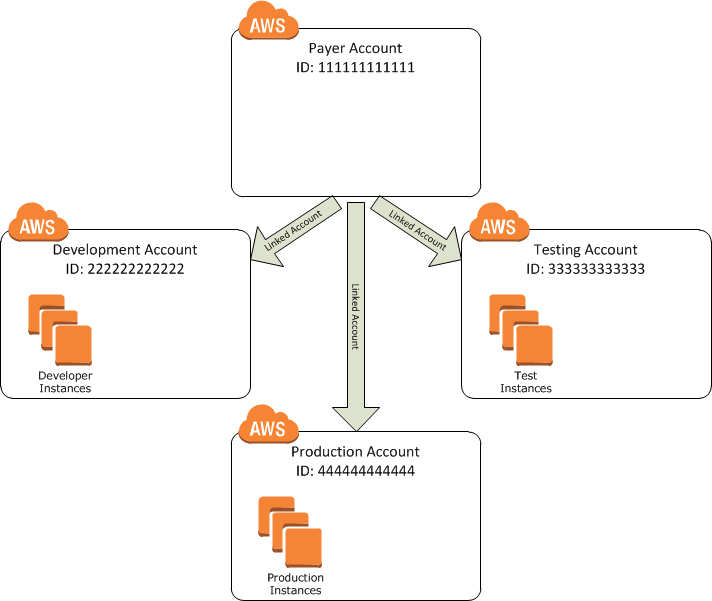

Amazon SNS and SQS is one of the most useful product provided by AWS. It is widely used to decouple products and enforce microservice
architecture.

Small business usually tend to operate on a single AWS account. As it is easy to maintain and operate. As your business grow, we should move away from operating on a single account, and adopt the multi-account pattern. It gives you many advantages, including:

1. Isolation of environment: operate dev and production environment differently
2. It can be leveraged for security
3. Enforcing the microservice architecture, as each team can have their own AWS account



However, to continue to use SNS together with SQS to decouple your service, you will need to have some setup to enable cross-account access.

Let's consider a simple case:

> Your team, team A, is in charge of a microservice that handles the billing for your end users. In order to generate the billing information, you will need to aggregate the usage of different services. Lucily, there is another team, team B, that have build the aggregation service and make it available for you to use.
> 
> However, because aggregation is a slow operation, team B has design it in a way that the request is asynchronous. In specfic, you will make the request for aggregation, team B only provides you a confirm that they have started the aggregation. Once the result is available, team B will provide it to you via a SNS topic.
> 
> This causes some problem for you. B team has their own AWS account, and the SNS topic is under their account. Since you don't own the SNS topic, you cannot directly subscribe a queue to it.

In order to solve this problem, we need to take advantage of resource-based policies in AWS.
In specific, we need to do 3 things to faciliate the cross-account subscription:

1. In team B's AWS account, we allow team A to subscribe to certain SNS topic
2. In team A's AWS account, create a SQS queue and add a policy to allow SNS topics in team B's account to write to the queue
3. In team A's account, create a subscription to the queue

First, we need to attach a policy to team B's SNS topics. Let's take a look at the policy:
```json
{
    "Version":"2012-10-17",
    "Id":"MyTopicSubscribePolicy",
    "Statement":[{
        "Sid":"Allow-other-account-to-subscribe-to-topic",
        "Effect":"Allow",
        "Principal":{
        "AWS":"111122223333"
        },
        "Action":"sns:Subscribe",
        "Resource":"arn:aws:sns:us-east-1:123456789012:MyTopic"
    }
    ]
}
```
This policy will allow `111122223333` AWS account(team A accout) to subscribe to `MyTopic`. This is the only change necessary for team B.

Then we need to create a queue and allow the SNS above to write to the queue. We need to attach the following policy to the queue:
```json
{
    "Version": "2012-10-17",
    "Id": "MyQueuePolicy",
    "Statement": [{
        "Sid":"MySQSPolicy001",
        "Effect":"Allow",
        "Principal":"*",
        "Action":"sqs:SendMessage",
        "Resource":"arn:aws:sqs:us-east-1:111122223333:MyQueue",
        "Condition":{
        "ArnEquals":{
            "aws:SourceArn":"arn:aws:sns:us-east-1:123456789012:MyTopic"
        }
        }
    }]
}
```
This policy will allow a specific SNS topic to publish to our queue.

Finally, we can create a subscription on AWS console/CLI/SDK. We can go to SNS page and create a subscription. Since we are using cross-account resource, you will need to provide the arn in order to create the subscription.

All the steps described above can actually be automatated using AWS CLI or AWS SDK.