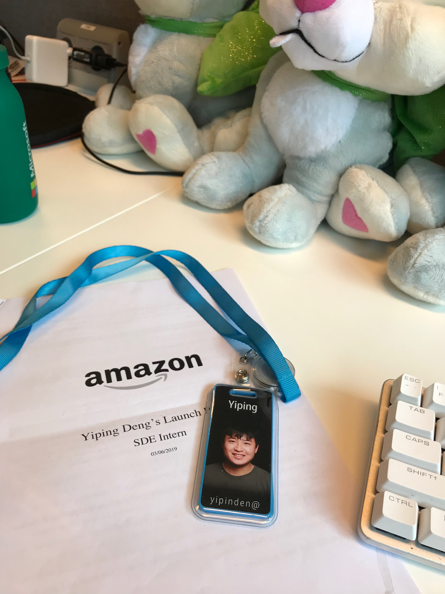
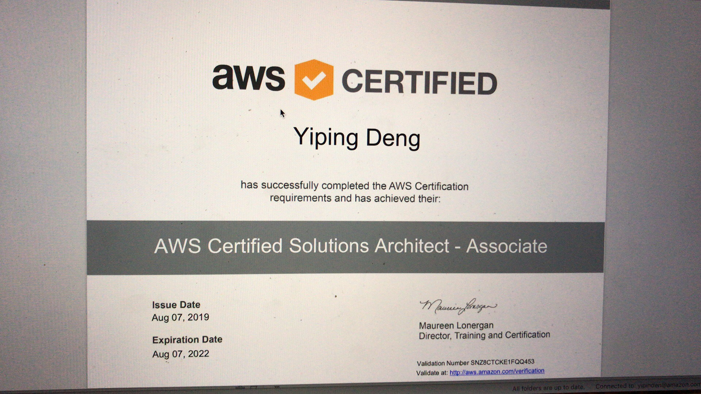

In March 2019, I received a call from HR at Amazon, congratulating me for a position at Amazon. I didn't hesitate upon this position, and I directly accept the offer. This is a chance to learn from a big company, and I certainly will not let it pass.

However, before I join the company, my expectation for Amazon is low. Several of my friends told me about their working style in Amazon and their workload. The only thing I expected from Amazon is the learning experience, and I would never consider a full-time position.

This view of Amazon has changed drastically in the three months I was at Amazon. 

The very first month is filled with surprises. I received a launch plan for my internship project. It is certainly not a hard project for me. In the past few years, I've already gathered experiences in web development, and my internship project demonstrated my strongest developer skill.

Despite being assigned to a not that exciting project, several areas of my technical skills have greatly improved over time. Before I joined the company, I didn't understand the value of software testing. To me, it was like writing code that will never make any value. During my time at Amazon, I picked up software testing from scratch. Apart from the benefits of increased software quality and reduction of bugs, I find that the code with tests is easier to understand.

Another area I have developed at Amazon is CI/CD. Every team at Amazon is self-sustaining: developers not only have to write code, but they also need to take care of software deployment and operations. Over the time, Amazon has developed its builder tools.(See this [article](https://gist.github.com/terabyte/15a2d3d407285b8b5a0a7964dd6283b0)) These tools help us to automate the software building, testing and deployment process. 

Operation is another area Amazon engineers need to take care themselvies. In my opinion, this is the driving force for better software quality. Since a better software quality will drastically reduce the operation load, the code quality has reached another level inside my team. Doing operation of distributed system is certainly something new to me. From reading metrics dashboard, to reading logs and queues, I have learned greatly about debugging large scale, service-oriented software.

Apart from technical learning at Amazon, it also brought me a completely different view in managing a tech team. Inside of Amazon, Agile development has gained its momentum. Sprint planning, backlog grooming, daily standup -- all these new concepts from the Agile process gave me a different opinion on the development cycle. Get your customer involved in the development process early, and adapt to customer requirement changes. In a Agile team is fun, and you have to take responsibility early on.

Amazon has a systematic way to make decisions, both technically and following the business requirements. It is expressed in the leadership principles at Amazon. Those principles drives Amazonians to make customer-facing decisions and sustain the continuous growth of the company.

However, not everything is as smooth as you expected. I have failed to get a return offer from Amazon. There are a few reasons that leads to this result:

1. I am graduating in 2020. Amazon is not able to give me a offer and wait for me in one year
2. My personality leads me to a different approch of software development. I prefer to take action early on, and delay the decision-making from the business team. I took the leadership principle "bias for action" too far, and "insist on the highest" is not considered in some of the cases. This is showned in my very first code review. I have many feedbacks from other developers, and we have iterated the code review many times to reach the acceptable level.
3. My team doesn't have any headcount this year. My team can't hire me, and they need to find me a new team if they want to hire me.

Despite the final setback, I still believe that this internship have gave me invaluable technical and management knowledge. Those experience will for sure stay with me and help me succeed in my career.

